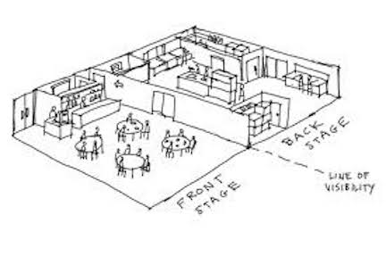

```{r echo = FALSE, message = FALSE}
library(knitr)
library(ggplot2)
library(ggthemes)
library(gridExtra)
library(dplyr)
library(tidyr)

knitr::opts_chunk$set(fig.path='figures/notes8/plot-')
```

## What is Shiny 

Shiny apps are a way to create online, interactive web applications that run R code. You can share them online for free by posting them to the shinyapps web page. The defaults are fairly simple, but you can now also use different formating choices to make very fancy applications.

## Shiny examples

To start, Shiny has several example apps that you can try out. These are all available through your R session once you install the Shiny package. You can make them available to your R session using the command `system.file()`:

```{r, eval = FALSE}
install.packages("shiny")
library(shiny)
system.file("examples", package = "shiny")
```

## Basics of Shiny apps

Once you have Shiny installed, you can run the examples using the `runExample()` command. For example, to run the first example, you would run:

```{r eval = FALSE}
runExample("01_hello")
```

## Basics of Shiny apps

This first example is a histogram that lets you adjust the number of bins using a slider bar. Other examples are: 

`02_text`, `03_reactivity`, `04_mpg`, `05_sliders`, `06_tabsets`, `07_widgets`, `08_html`, `09_upload`, `10_download`, `11_timer`.

You can run these all the same way. 

## Basics of Shiny apps

When you run any of these, a window will come up in your R session that shows the Shiny App, and your R session will pay attention to commands it gets from that application until you close the window. 

Notice that if you scroll down, you'll be able to see the code that's running behind the application.

## UI / Server

Generally, each application takes two files: (1) a user interface file and (2) a server file. You can kind of think of the two elements of an R shiny app, the user interface and the server, as two parts of a restaurant.



## UI / Server

The user interface is the dining area. This is the only place the customer every sees. It's where the customer makes his order, and it's also where the final product comes out for him to consume. 


## UI / Server

The server is the kitchen. It takes the order, does all the stuff to make it happen, and then sends out the final product back to the dining area. 


## Shiny directory

At its heart, an R shiny app is just a directory on your computer or a server with these two files (as well as any necessary data files) in it. For example, here's a visual of an App I wrote to go with a paper: 


## Shiny app

The heart of the application are `server.R` and `ui.R`.

If I open either of these main files in RStudio, I can run the application locally using a button at the top of the file called "Run App".

Once I have the App running, if I have an account for the Shiny server, I can choose to "Publish" the application to the Shiny server, and then anyone can access and use it online.

# `server.R` file

## `server.R` file

This file tells R what code to run with the inputs it gets from a user making certain selections. 

For example, for the histogram example, this file tells R how to re-draw a histogram of the data with the number of bins that the user specified on the slider on the application. 

This file also will have code telling R what to send back to the application for the user to see (in this case, a picture of a histogram made with the specified number of bars). 

## `server.R` file

```{r eval = FALSE}
library(shiny)

shinyServer(function(input, output) {

  output$distPlot <- renderPlot({
    x    <- faithful[, 2]  
    bins <- seq(min(x), max(x), length.out = input$bins + 1)
    hist(x, breaks = bins, col = 'darkgray', border = 'white')
  })

})
```

## `server.R` file

Notice that some of the "interior" code here looks very familiar.

For example, this file has within it some code to figure out the breaks for histogram bins, based on how many total bins you want, and draw a histogram with those bin breaks:

```{r eval = FALSE}
x    <- faithful[, 2]  
bins <- seq(min(x), max(x), length.out = input$bins + 1)
hist(x, breaks = bins, col = 'darkgray', border = 'white')
```

## `server.R` file

This code is then "wrapped" in two other functions. First, this code is generating a plot that will be posted to the application, so it's wrapped in a `renderPlot` function to send that plot as output back to the application:

```{r eval = FALSE}
output$distPlot <- renderPlot({
    x    <- faithful[, 2] 
    bins <- seq(min(x), max(x), length.out = input$bins + 1)
    hist(x, breaks = bins, col = 'darkgray', border = 'white')
  })
```

## `server.R` file

Notice that this code is putting the results of `renderPlot` into a slot of the object `output` named `distPlot`. We could have used any name we wanted to here, not just `distPlot`, for the name of the slot where we're putting this plot, but it is important to put everything into an object called `output`.

Now that we've rendered the plot and put it in that slot of the `output` object, we'll be able to refer to it by its name in the user interface file, when we want to draw it somewhere there.

## `server.R` file

All of this is wrapped up in another wrapper:

```{r eval = FALSE}
shinyServer(function(input, output) {
  output$distPlot <- renderPlot({
    x    <- faithful[, 2]  
    bins <- seq(min(x), max(x), length.out = input$bins + 1)
    hist(x, breaks = bins, col = 'darkgray', border = 'white')
  })
})
```

## `server.R` file

The `server.R` file also has a line to load the `shiny` package. You should think of apps as being like Rmd files-- if there are any packages or datasets that you need to use in the code in that file, you need to load it within the file, because R won't check in your current R session to find it when it runs the file.

# `ui.R` file

## `ui.R` file

The other file that a Shiny app needs is the user interface file (`ui.R`). 

This is the file that describes how the application should look. It will write all the buttons and sliders and all that you want for the application interface. 

This is also where you specify what you want to go where and put in any text that you want to show up. 

For example, the next page has the `ui.R` file for the histogram example.

## `ui.R` file

```{r eval = FALSE}
library(shiny)

shinyUI(fluidPage(
  titlePanel("Hello Shiny!"),
  sidebarLayout(
    sidebarPanel(
      sliderInput("bins",
                  "Number of bins:",
                  min = 1,
                  max = 50,
                  value = 30)
    ),
    mainPanel(
      plotOutput("distPlot")
    )
  )
))
```

## `ui.R` file

There are a few things to notice with this code. 

First, there is some code that tells the application to show the results from the `server.R` code. For example, the following code tells R to show the histogram that we put into the `output` object in the `distPlot` slot and to put that graph in the main panel of the application:

```{r eval = FALSE}
mainPanel(
      plotOutput("distPlot")
)
```

## `ui.R` file

Other parts of the `ui.R` code will tell the application what kinds of choice boxes and sliders to have on the application, and what default value to set each to. 

For example, the following code tells the application that it should have a slider bar that can take a minimum value of 1 and a maximum value of 50. When you first open the application, its default value should be 30. 

```{r eval = FALSE}
sliderInput("bins",
            "Number of bins:",
             min = 1,
             max = 50,
             value = 30)
```

## `ui.R` file

It should be annotated with the text "Number of bins:". Whatever value is selected should be saved to the `bins` slot of the `input` object.

```{r eval = FALSE}
sliderInput("bins",
            "Number of bins:",
             min = 1,
             max = 50,
             value = 30)
```

## Resources for learning Shiny

There is an excellent tutorial to get you started [here](http://shiny.rstudio.com/tutorial/lesson1/) at RStudio. 

There are also several great sites that show you both Shiny examples and their code, [here](http://shiny.rstudio.com/gallery/) and [here](http://www.showmeshiny.com).
